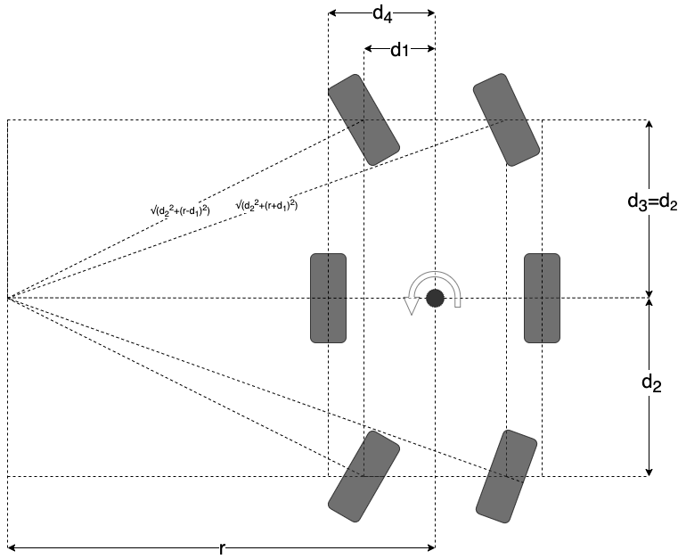

# ROS related code

## Colcon Packages

There are 4 colcon packages contained in this repo. Each of these packages performs a specific purpose in the ROS 
structure, which are covered below

  * `osr_control`: core code that talks to motor drivers and listens to commands 
  * `osr_interfaces`: custom message definitions
  * `osr_bringup`: configuration and launch files for starting the rover

Please refer to the docstrings wihin each file to gain understanding of the internals as that is the most
up-to-date and complete source of information.

### osr_control

  * `roboclaw.py`: copy of the roboclaw python library, API to the roboclaw controllers. ROS agnostic
  * `roboclaw_wrapper.py`: ROS node that wraps around and abstracts the roboclaw library. Takes in commands and reports 
  state of each motor
  * `servo_control.py`: ROS node that takes commands from the Rover node to send the corner servo motors to an angle and relays those to the PCA9685 chip
  * `rover.py`: ROS node that controls the rover, taking in high-level commands and calculating motor commands which are
  sent to `roboclaw_wrapper.py`

Note that a positive angular twist corresponds to a positive turning radius and turning left while driving forward.

### osr_interfaces

Contains custom message definitions used for the rover. Please refer to the message definitions for details
and units.

### osr_bringup 

The osr_bringup package contains the launch file necessary to start all the ROS nodes, 
as well as the operating parameters for the robot.

# SIEL Rover (4-Wheel Independent Drive & 4WS) Modification Guide

このドキュメントは、NASA JPLのOpen Source Rover (6輪ボギー・アッカーマン) をベースに、**4輪独立駆動 ＋ 4輪ステアリング（4WD/4WS）** のオリジナルローバーを構築するために行ったソフトウェアおよび設定の変更点をまとめたものです。

## 概要

* **ベースプロジェクト**: [nasa-jpl/open-source-rover]
* **変更の目的**: 機体構造を6輪から4輪へ変更し、より機動性の高い全方向移動（ステアリング）に対応させる。
* **主な変更方針**:
  * ROS 2の抽象化されたノード構造（頭脳・通訳・設定）を維持する。
  * `rover.py` の運動学計算（数学）を4輪用に書き換える。
  * ハードウェアの制御ノード（Wrapper）の基板枚数やピン設定を削減・最適化する。

---

## 1. 頭脳（ロジック）の変更

### `src/osr_control/osr_control/rover.py`
機体の運動を計算するメインノード。6輪ボギー特有の計算を削除し、4輪独立駆動用のシンプルな数式に置き換えた。

* **`forward_kinematics()` の完全書き換え**
  * 変更前: 4隅の角度から中央値を推定し、中間車輪の速度から直進速度を計算。
  * 変更後: 4輪それぞれのエンコーダ速度（V）をロボット正面方向（cos）に分解し、その平均を直進速度（`linear.x`）とする。
  * 旋回速度（`angular.z`）も、4輪の速度差と機体寸法（d1, d3）から直接算出するように変更。
* **関節数の判定変更**
  * 10個（ドライブ6＋サーボ4）揃ったかの判定を、8個（ドライブ4＋サーボ4）に変更。
* **不要ロジックの整理**
  * 使用されていない `corner_cmd_threshold` (不感帯フィルター) などのコメントアウト箇所を整理（またはサーボ送信時のみに適用）。

---

## 2. パラメータ（機体寸法と制限）の変更

### `src/osr_bringup/config/osr_params.yaml`
ロボットの物理的な大きさとモーターの限界値を定義するファイル。

* **機体寸法の再定義**
  * `d1`: 左右のタイヤ間隔（トレッド幅）の半分の距離に変更（例: `0.200` m）。
  * `d3`: 前後のタイヤ間隔（ホイールベース）の半分の距離に変更（例: `0.250` m）。
  * `d2`, `d4`: 4輪では使用しないため削除（または無視）。
  * `wheel_radius`: 実際に使用するタイヤの半径に修正。
* **モータースペックの更新**
  * `drive_no_load_rpm`: 使用する駆動モーターの無負荷時RPMカタログ値に変更。

---

## 3. ハードウェアラッパー（通訳）の変更

### `src/osr_control/osr_control/roboclaw_wrapper.py`
走行モーター（エンコーダ付き）を制御するノード。

* **基板枚数の削減（3枚 ➔ 2枚）**
  * 1枚の基板で2つのモーターを制御するため、6輪（3枚）から4輪（2枚）構成へ変更。
  * コード内の温度監視やエラーチェックなどのループ処理を `range(3)` から `range(2)` に修正。
* **マッピングの削減**
  * `__init__` 内の `roboclaw_mapping` 辞書への登録を、中間タイヤ（Middle）を削除し、4輪分（FL, FR, BL, BR）のみにスリム化。
  * 送信メソッド `send_drive_buffer_velocity` も同様に4輪分へ削減。

### `src/osr_control/osr_control/servo_control.py` & Launchファイル
ステアリングサーボモーターをPCA9685経由で制御するノード。Pythonのロジック自体は変更不要だが、サーボの仕様に合わせて初期値をハードコーディング（またはパラメータ化）して書き換えた。

* **サーボ仕様の書き換え (Python内)**
  * `servo_actuation_range`: 300度から、使用するサーボの限界角度（180度など）へ変更。
  * `pulse_width_range`: サーボの仕様書に合わせたPWMのMin/Max値 (例: 500, 2500) へ変更。
  * `deg_per_sec`: 使用するサーボの回転速度スペックに合わせて修正。
* **キャリブレーション値の注入 (Launchファイル)**
  * `osr_launch.py` 内の `centered_pulse_widths` 配列に、組み立て後に実測した「直進するPWM値」のオフセットを入力。

---

## 4. テスト・キャリブレーション用スクリプト

`OSR_NEW_ROVER/scripts/` 以下の単発実行スクリプトについて。

* **`calibrate_servos.py`**: そのまま使用可能。組み立て後のサーボのセンター出し（PWM値の探索）に使用。
* **`rc_config.py`**: RoboClawの初期設定。3枚分あった設定処理を2枚分（アドレス変更など）に修正。
* **`roboclaw_movemotor.py` / `roboclawtest.py`**: 動作確認スクリプト。ループやアドレス指定を2枚基板（4モーター）用に修正して使用。

---